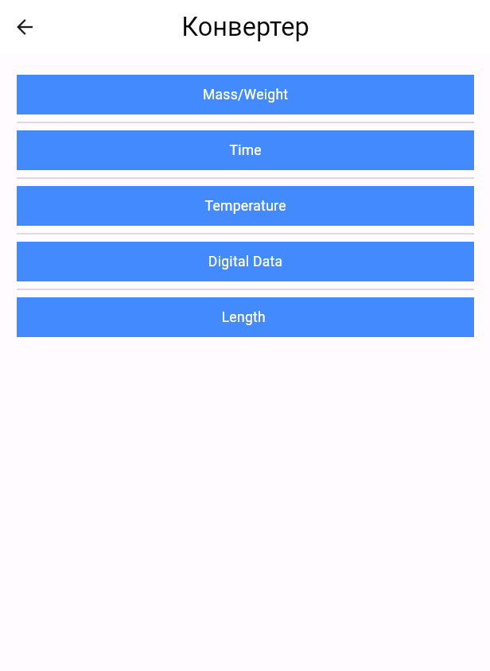
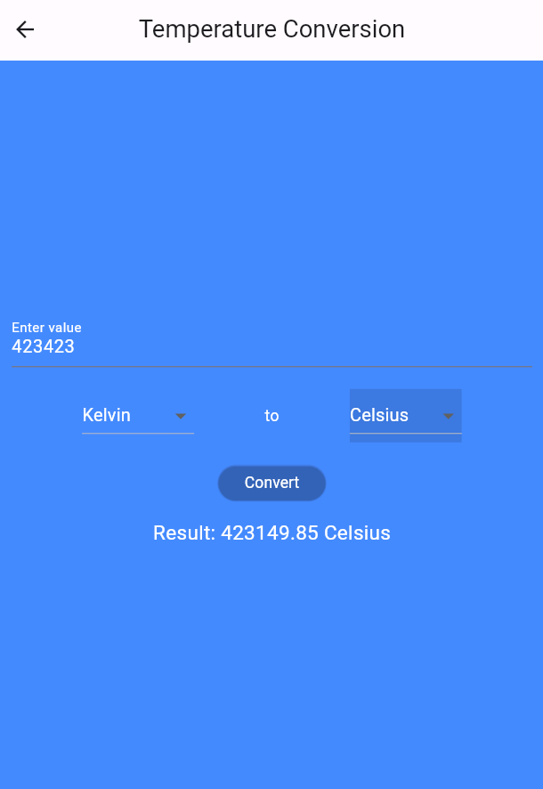

# Flutter Theme Converter App

The Flutter Theme Converter App is a versatile mobile application built using Dart and Flutter. It provides users with the ability to customize the appearance of the app by switching between light and dark themes effortlessly. Additionally, the app offers a feature for converting various units of measurement, catering to the user's practical needs.

## Key Features:

  ###  Theme Switching:
        Users can seamlessly switch between light and dark themes to personalize their app experience.
        The app's UI elements dynamically adjust to the selected theme,
        providing a visually appealing and comfortable environment.
.png) 

   ### Unit Conversion:
        The app supports the conversion of different units, such as length, weight, temperature, and more.
        Users can input values, select the source unit, choose the target unit, and instantly view the converted result.

  ###  Intuitive User Interface:
        The user interface is designed to be user-friendly and intuitive, 
        ensuring a smooth and enjoyable experience for users of all levels.
.png) 

  ###  Customization Options:
        Users have the flexibility to customize the app's appearance based on their preference.
        The app stores the selected theme, providing a consistent experience across sessions.

## How to Use:

   ### Theme Switching:
        Locate the theme switcher in the app's settings or main menu.
        Toggle between "Light" and "Dark" themes based on your preference.

  ### Unit Conversion:
        Navigate to the unit conversion section.
        Select the type of conversion (e.g., length, weight).
        Input the value and choose the source and target units.
        View the converted result instantly.
 

  ###  Customization:
        Explore additional customization options in the settings menu.
        Save your preferred theme for future sessions.

## Technical Details:

    Language: Dart
    Framework: Flutter
    State Management: Provider (or any other preferred state management solution)
    Theme Management: Flutter's in-built theme management system
    Conversion Logic: Implement conversion functions for each unit type.

### Note: Ensure that you have Flutter and Dart installed on your development environment to run and test the application.
